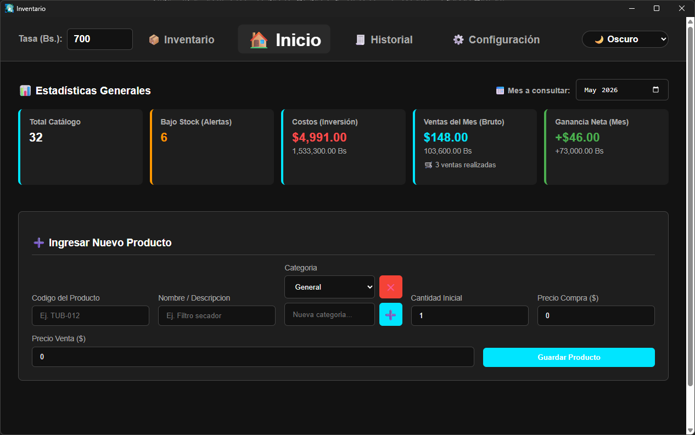
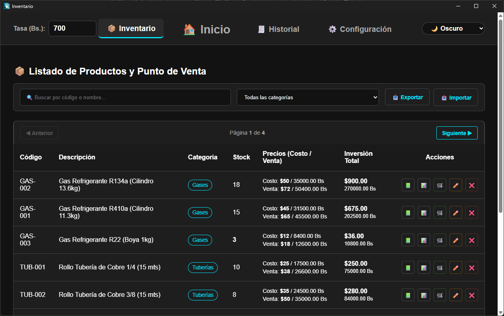
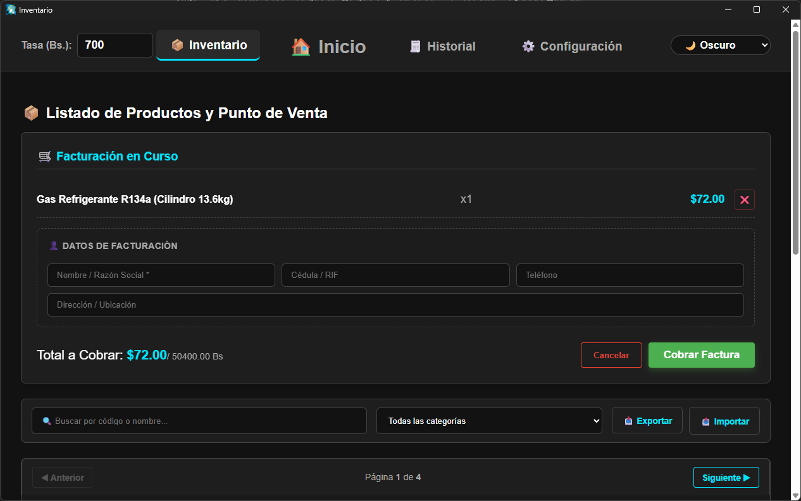
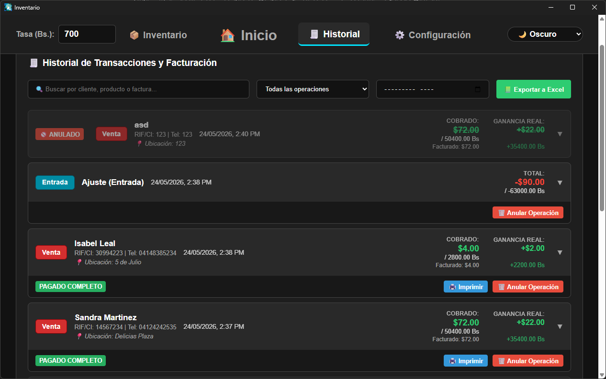
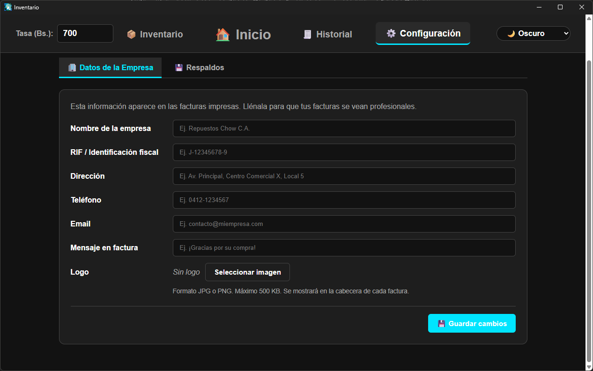

# Inventario Chow

Aplicación de escritorio full-stack para la gestión de inventarios empresariales. Permite administrar productos, controlar stock, registrar ventas con facturación, gestionar clientes y trabajar con múltiples monedas, todo desde una sola aplicación instalable en Windows.

## Descargar la aplicación

Puedes probar la aplicación sin compilar nada: descarga el instalador para Windows desde la sección de **[Releases](https://github.com/LuisChow/sistema-inventario/releases/latest)**.

> **Nota:** el instalador no tiene firma digital, así que Windows mostrará una advertencia de SmartScreen al abrirlo. Haz clic en **"Más información"** y luego en **"Ejecutar de todos modos"** para continuar.

## Capturas de pantalla

### Panel de inicio



Estadísticas generales del negocio: total de catálogo, alertas de stock bajo, costos de inversión, ventas brutas y ganancia neta del mes.

### Inventario y punto de venta



Listado de productos con búsqueda, filtros por categoría, paginación, e importación/exportación de datos.

### Facturación



Carrito de ventas con datos de facturación del cliente y cobro de la factura.

### Historial de transacciones



Registro de todas las operaciones (ventas, ajustes, anulaciones) con la ganancia real calculada por cada venta.

### Configuración



Datos de la empresa para las facturas impresas y sistema de respaldos de la base de datos.

## Características

- **Gestión de productos** — Alta, baja, modificación y consulta de productos (repuestos) organizados por categorías.
- **Control de stock** — Registro de movimientos de entrada y salida con trazabilidad completa de cada artículo.
- **Ventas y facturación** — Carrito de ventas, generación e impresión de facturas.
- **Gestión de clientes** — CRUD completo de clientes.
- **Multi-moneda** — Manejo de tasas de cambio para operar en distintas divisas.
- **Respaldos automatizados** — Sistema de backup y restauración de la base de datos, con restauración segura al inicio de la aplicación.
- **Exportación a Excel** — Reportes exportables con formato mediante `xlsx-js-style`.
- **Atajos de teclado** — Navegación rápida mediante shortcuts configurables.
- **Configuración personalizable** — Panel de ajustes de la aplicación.

## Stack tecnológico

| Capa          | Tecnologías                                               |
| ------------- | --------------------------------------------------------- |
| Escritorio    | Electron, electron-builder (instalador NSIS para Windows) |
| Frontend      | Angular 21 (componentes standalone, Signals, RxJS)        |
| Backend       | Node.js, Express 5, API REST                              |
| Base de datos | SQLite                                                    |
| Utilidades    | xlsx / xlsx-js-style (exportación a Excel)                |

## Arquitectura

El proyecto está dividido en dos módulos independientes:

```
sistema-inventario/
├── backend-inventario/      # Proceso principal de Electron + servidor Express
│   ├── main.js              # Punto de entrada de Electron (crea la ventana)
│   ├── server.js            # API REST con 27+ endpoints
│   ├── lib/
│   │   ├── db.js            # Capa de acceso a SQLite
│   │   └── validators.js    # Esquemas de validación de datos
│   └── build/               # Iconos de la aplicación
│
└── frontend-angular/        # Interfaz de usuario en Angular
    └── src/app/
        ├── core/            # Servicios singleton e interceptores HTTP
        ├── features/        # Módulos: inventory, dashboard, settings
        └── shared/          # Componentes reutilizables (toast, dialogs, etc.)
```

El frontend en Angular sigue una arquitectura modular en tres capas: **core** (servicios e inyección de dependencias), **features** (vistas de negocio) y **shared** (componentes de UI reutilizables). La comunicación con el backend pasa por interceptores HTTP que gestionan el estado de carga global y el manejo centralizado de errores.

La base de datos SQLite se almacena en la carpeta `Documentos/Inventario Chow/` del usuario, fuera del directorio de instalación, para preservar los datos entre actualizaciones de la aplicación.

## Instalación y ejecución

### Requisitos previos

- Node.js 18 o superior
- npm

### Pasos

1. Clonar el repositorio:

```
git clone https://github.com/LuisChow/sistema-inventario.git
cd sistema-inventario
```

2. Instalar dependencias del backend:

```
cd backend-inventario
npm install
```

3. Instalar dependencias del frontend:

```
cd ../frontend-angular
npm install
```

4. Compilar el frontend de Angular:

```
npm run build
```

5. Iniciar la aplicación de escritorio:

```
cd ../backend-inventario
npm start
```

### Generar el instalador de Windows

```
cd backend-inventario
npm run dist
```

El instalador `.exe` se generará en la carpeta `dist/`.

## API REST

El backend expone más de 27 endpoints organizados por recurso:

| Recurso         | Endpoints                                                                  |
| --------------- | -------------------------------------------------------------------------- |
| Productos       | `GET/POST/PUT/DELETE /api/repuestos`                                       |
| Movimientos     | `GET/POST /api/movimientos`, `DELETE /api/movimientos/factura/:id`         |
| Ventas          | `POST /api/ventas`                                                         |
| Categorías      | `GET/POST/PUT/DELETE /api/categorias`                                      |
| Clientes        | `GET/POST/PUT/DELETE /api/clientes`                                        |
| Configuración   | `GET/PUT /api/configuracion`                                               |
| Tasas de cambio | `GET/POST /api/tasas`, `GET /api/tasas/latest`                             |
| Respaldos       | `GET/POST /api/backup`, `POST /api/restore`, `DELETE /api/backups/:nombre` |

## Autor

**Luis Fernando Chunwa Chow Cheung**
Estudiante de Ingeniería en Computación — Universidad Rafael Urdaneta
GitHub: [@LuisChow](https://github.com/LuisChow)

## Licencia

Copyright (c) 2025 Luis Fernando Chunwa Chow Cheung. Todos los derechos reservados.

Este proyecto se publica con fines de demostración y evaluación profesional. El código puede examinarse, pero no está permitido copiarlo, reutilizarlo, modificarlo ni redistribuirlo sin autorización previa del autor. Consulta el archivo [LICENSE](https://github.com/LuisChow/sistema-inventario/blob/main/LICENSE) para más detalles.
